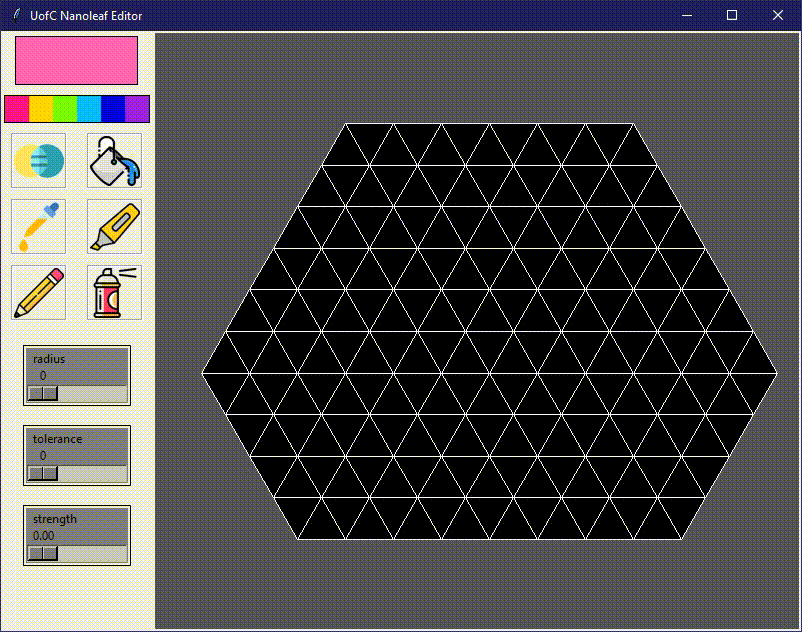

# NanoLeaf App

To be used for the University of Calgary's Nanoleaf setup.

### How to run:
- Create fresh conda environment
    - `conda create --name nanoleaf python=3.9`
- Go to environment and activate
    - `conda activate nanoleaf`
- Clone repo 
    - `git clone https://github.com/matthewnevelos/Nanoleaf-App.git`
- Download all required libraries
    - `pip install -r other/requirements.txt`
- Run `NL_paint.py`

### App Showcase:

